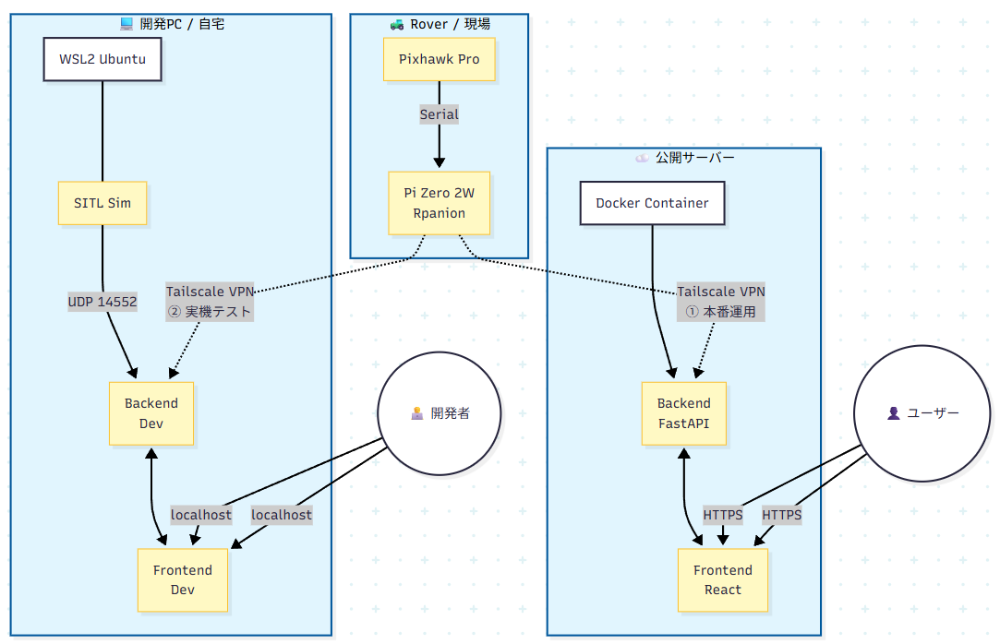

# rover-gcs

ArduPilot Rover 向けの多機能な Ground Control Station (GCS) Web アプリケーションです。
モダンな Web 技術（React + Vite）と Python バックエンドを組み合わせ、リアルタイムな機体制御とモニタリングを実現しています。

## 目次

- [主な機能](#主な機能)
- [操作方法](#操作方法)
- [ディレクトリ構成](#ディレクトリ構成)
- [必要要件](#必要要件)
- [セットアップ手順](#セットアップ手順)
- [起動方法](#起動方法)
- [開発用 ArduPilot シミュレーター起動手順](#開発用-ardupilot-シミュレーター起動手順)
- [ログ / 設定ファイル](#ログ--設定ファイル)
- [システム構成](#システム構成)
- [ライセンス](#ライセンス)

## 主な機能

- **リアルタイムテレメトリ表示**:
  - **基本情報**: 接続状態、フライトモード、Armed状態
  - **HUD**: 速度 (m/s, km/h), 方位, 高度, スロットル出力
  - **ステータス**: バッテリー電圧/電流, CPU負荷
  - **ログ**: 機体からのテキストメッセージ (STATUSTEXT) 表示
- **機体制御**:
  - **システム**: Arm/Disarm 切り替え、モード変更 (MANUAL, GUIDED, AUTO, HOLD, RTL, SMART_RTL)
  - **マニュアル操作**:
    - **ジョイスティック**: 仮想ジョイスティックによる直感的な操作（正方形領域でフルスロットル・フルステアが可能）
    - **スライダー**: スロットルとステアリングを個別に調整可能なスライダーモード
    - キーボード操作 (矢印キー) 対応
    - スロットルレンジ調整 (+/- 150 ~ 1000)
    - 定期送信機能 (フェイルセーフ対策)
- **セキュリティ**:
  - **簡易認証**: 操作画面へのアクセス時にパスワード認証を要求
- **インタラクティブマップ**:
  - Leaflet ベースの地図表示 (最大ズーム Lv22)
  - 航空写真（Satellite）と標準地図（OSM）の切り替え
  - 機体アイコンの切り替え（矢印 / 車）と方位連動
  - 走行軌跡（Trajectory）の描画
  - 地図クリックによる移動目標指示 (Guided Mode)
- **UI / UX**:
  - **モバイル最適化**:
    - スマホ横持ち (Landscape) 時に「左：操作パネル / 右：地図」の分割レイアウトを適用
    - 縦持ち時は操作パネルを最上部に配置し、重要なログのみを表示
    - `dvh` (Dynamic Viewport Height) 対応でブラウザのメニューバーによる表示崩れを防止
  - 必要な情報をサイドバーに集約し、地図領域を最大化
- **高度な視覚認識機能 (Advanced Mode)**:
  - ローバー搭載のスマートフォンからの映像をリアルタイムで表示
  - 映像からの物体検知 (YOLO) と距離表示

## 操作方法

### マニュアル操作 (Manual Control)

画面左下のパネル、またはキーボードで操作可能です。

- **キーボード操作**:
  - `↑` または `E`: 前進 (設定されたレンジ分)
  - `↓` または `D`: 後退 (設定されたレンジ分)
  - `←` または `S`: 左旋回
  - `→` または `F`: 右旋回
  - キーを離すとニュートラル (1500) に戻ります。
  - ※入力フォーム等にフォーカスがある場合は無効になります。

- **設定**:
  - **Tx Interval**: マニュアル制御信号の定期送信間隔 (Off, 1s, 2s, 5s, 10s)。ArduPilotのGCSフェイルセーフ設定に合わせて調整してください。
  - **Throttle Range**: スロットル操作の感度/最大幅を設定します (Safe: 150 ~ Max: 1000)。

### Guided Mode (地図クリック移動)

地図上の任意の場所を**右クリック**すると、メニューが表示されます。
「ここに移動」を選択すると、機体モードが **GUIDED** に切り替わり、指定した地点へ自律移動を開始します。

## ディレクトリ構成

- `frontend/` : React + Vite 製の Web UI
- `backend/`  : Python (FastAPI) 製の GCS バックエンド

## 必要要件

- Node.js (推奨: 18 以上)
- npm
- Python 3.10 以上
- `pip` (Python パッケージマネージャ)

## セットアップ手順

### 1. リポジトリのクローン

```bash
git clone https://github.com/zorosdrone/rover-gcs.git
cd rover-gcs
```

### 2. バックエンドのセットアップ

```bash
cd backend
python3 -m venv venv
source venv/bin/activate
pip install -r requirements.txt

# パスワードファイルを作成（任意のパスワードを設定）
echo "your_password" > password.txt
```

### 3. フロントエンドのセットアップ

別のターミナル、または仮想環境を抜けた後に実行します。

```bash
cd frontend
npm install
```

## 起動方法

### ローカル開発（推奨）

便利な起動スクリプトを用意しています。

#### 1. シミュレーター (SITL) の起動

ターミナルを開き、以下のスクリプトを実行します。
ArduPilot の SITL が起動し、MAVProxy コンソールとマップが表示されます。

```bash
./start_sitl.sh
```

#### 2. アプリケーション (Backend + Frontend) の起動

別のターミナルを開き、以下のスクリプトを実行します。
Python バックエンドと React フロントエンドが一括で起動します。

```bash
./start_dev.sh
```

ブラウザが自動的に開かない場合は `http://localhost:5173` にアクセスしてください。
終了時は `Ctrl+C` を押すと、バックエンドとフロントエンドの両方が停止します。

### 手動での起動（参考）

スクリプトを使用せず、個別に起動する場合の手順です。

#### 1. バックエンドの起動

```bash
cd backend
source venv/bin/activate
uvicorn main:app --host 0.0.0.0 --port 8000 --reload
```

#### 2. フロントエンドの起動

別ターミナルで実行します。

```bash
cd frontend
npm run dev
```


### Docker 本番運用（Caddy等のリバースプロキシ前提）

本番運用は `Dockerfile.prod` と `docker-compose.prod.yml` のみを使用します。
旧 `docker-compose.yml` や `backend/Dockerfile`, `frontend/Dockerfile` は不要です。

```bash
docker compose -f docker-compose.prod.yml up --build -d
```

- バックエンド: コンテナ内ポート `8000` をホスト `8001` に公開（`ws://<host>:8001/ws`）
- フロントエンド: Reactビルド済み静的ファイルをFastAPIが配信（`http://<host>:8001/`）

本番では Caddy / Nginx などで、`/` をFastAPI（API+静的ファイル）にリバースプロキシする構成を想定しています。

**開発は `start_dev.sh` で直接起動するのが推奨です。**

## 開発用 ArduPilot シミュレーター起動手順

開発時は ArduPilot の SITL (Software In The Loop) シミュレーターを起動し、rover-gcs と接続して動作確認を行います。

### 1. ArduPilot のソースコード取得

ArduPilot の公式ドキュメントに従ってセットアップしてください。例（Linux）:

```bash
cd ~
git clone https://github.com/ArduPilot/ardupilot.git
cd ardupilot
git submodule update --init --recursive
Tools/environment_install/install-prereqs-ubuntu.sh -y
```

一度ログアウト・ログイン、または `~/.profile` を再読み込みして PATH を反映します。

### 2. Rover SITL の起動

プロジェクトルートにある `start_sitl.sh` を使用するのが簡単です。

```bash
./start_sitl.sh
```

手動で起動する場合は、`ardupilot` ディレクトリで次を実行します。
バックエンドが UDP 14552 ポートで待ち受けているため、`--out` オプションで出力を追加します。

```bash
cd ~/ardupilot/ArduRover
sim_vehicle.py -v Rover -f rover-skid --console --map --out=udp:127.0.0.1:14552
```

### 3. rover-gcs との接続

1. 上記の SITL を起動しておく
2. `rover-gcs` のバックエンドとフロントエンドを起動（`./start_dev.sh`）

バックエンドはデフォルトで `udp:0.0.0.0:14552` をリッスンします。
SITL 以外の実機や他のシミュレータと接続する場合は、`backend/main.py` の `CONNECTION_STRING` を環境に合わせて変更してください。

## ログ / 設定ファイル

- `backend/logs/` : バックエンドのログ (`LASTLOG.TXT` など)
- `backend/mav.parm` : 機体のパラメータファイル
- `backend/eeprom.bin` : EEPROM データ
- `backend/mav.tlog*` : テレメトリログ

## システム構成



より詳細な構成やデータフローについては `docs/architecture.md` を、ハードウェアやArduPilotパラメータ設定などの詳細な仕様については `docs/SystemSpecifications.md` を参照してください。

## ライセンス

このリポジトリのライセンスは未記載です。公開・再配布前にリポジトリオーナーに確認してください。
