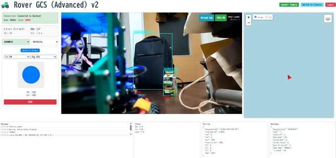
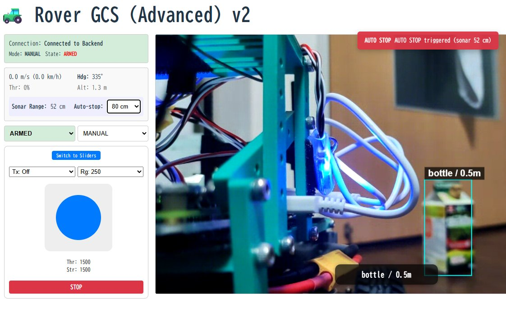

# rover-gcs

ArduPilot Rover 向けの多機能な Ground Control Station (GCS) Web アプリケーションです。
モダンな Web 技術（React + Vite）と Python バックエンドを組み合わせ、リアルタイムな機体制御とモニタリングを実現しています。

**プロジェクト背景 (Project Background)**

本プロジェクトは、「ドローンエンジニア養成塾 第20期」（2025年秋冬）における最終発表（フライトデイ）に向けた成果物として、約1.5ヶ月という極めて短期間で集中的に構築されました。
開発の根底にあるのは、**「Webブラウザからローバー（自作UGV）を直感的かつ安全に動かしたい」**というシンプルな情熱です。既存のGCS（地上管制局）の枠に捉われず、モダンなWeb技術（React + FastAPI）とArduPilotを融合させることで、モバイル回線を経由したセキュアな遠隔運用と、高度な知能化機能の統合を目指しました。

1. AI駆動開発（Vibe Coding）の実践

  本プロジェクトの最大の特徴は、Gemini、GitHub Copilot、GPT-5.1miniといった生成AIを全面的に活用した**「AI駆動型開発（Vibe Coding）」**にあります。
  - 開発効率の極大化: AIを「副操縦士」として、アーキテクチャの決定やトラブルシューティングに集中することで、未経験領域の実装を含む合計76回のコミットを短期間に積み上げました。
  - 独自ロジックの実装: ArduPilotのManualモードには標準で存在しない**「Auto-stop（安全停止）」機能**を、AIの支援により自力でコード化し、LiDAR/Sonarセンサーを用いた衝突回避を実現しました。

2. 技術的マイルストーン

  単なる操作ツールを超え、以下の高度な機能を1つのWeb UIに集約しています。
  - 超低遅延映像配信: WebRTC（VDO.Ninja）の導入により、映像遅延を実用レベルの0.3秒以下まで短縮しました。
  - AI視覚認識: YOLOを用いたリアルタイム物体検知と、それに基づくターゲットとの距離計測機能を統合しました。
  - クロスプラットフォーム運用: タブレット表示に最適化したレイアウトや、TailscaleによるVPNを用いた安全なロングレンジ運用を可能にしています。

このプロジェクトは、AIという強力なツールを使いこなすことで、**「設計図を書きながら猛スピードで実機を完成させる」**という、現代的なスピード感あるエンジニアリングの可能性を証明するものです。

## 目次

- [主な機能](#主な機能)
- [操作方法](#操作方法)
- [ディレクトリ構成](#ディレクトリ構成)
- [必要要件](#必要要件)
- [セットアップ手順](#セットアップ手順)
- [起動方法](#起動方法)
- [ログ / 設定ファイル](#ログ--設定ファイル)
- [システム構成](#システム構成)
- [ライセンス](#ライセンス)
- [ドキュメント](#ドキュメント)

## 主な機能

- **リアルタイムテレメトリ表示**:
  - **基本情報**: 接続状態、フライトモード、Armed状態
  - **HUD**: 速度 (m/s, km/h), 方位, 高度, スロットル出力
  - **ステータス**: バッテリー電圧/電流, CPU負荷
  - **ログ**: 機体からのテキストメッセージ (STATUSTEXT) 表示
- **機体制御**:
  - **システム**: Arm/Disarm 切り替え、モード変更 (MANUAL, GUIDED, AUTO, HOLD, RTL, SMART_RTL)
  - **マニュアル操作**:
    - **ジョイスティック**: 仮想ジョイスティックによる直感的な操作（正方形領域でフルスロットル・フルステアが可能）
    - **スライダー**: スロットルとステアリングを個別に調整可能なスライダーモード
    - キーボード操作 (矢印キー) 対応
    - スロットルレンジ調整 (+/- 150 ~ 1000)
    - 定期送信機能 (フェイルセーフ対策)
- **セキュリティ**:
  - **簡易認証**: 操作画面へのアクセス時にパスワード認証を要求
- **インタラクティブマップ**:
  - Leaflet ベースの地図表示 (最大ズーム Lv22)
  - 航空写真（Satellite）と標準地図（OSM）の切り替え
  - 機体アイコンの切り替え（矢印 / 車）と方位連動
  - 走行軌跡（Trajectory）の描画
  - 地図クリックによる移動目標指示 (Guided Mode)
- **UI / UX**:
  - **モバイル最適化**:
    - スマホ横持ち (Landscape) 時に「左：操作パネル / 右：地図」の分割レイアウトを適用
    - 縦持ち時は操作パネルを最上部に配置し、重要なログのみを表示
    - `dvh` (Dynamic Viewport Height) 対応でブラウザのメニューバーによる表示崩れを防止
  - 必要な情報をサイドバーに集約し、地図領域を最大化
- **高度な視覚認識機能 (Advanced Mode)**:
  - ローバー搭載のスマートフォンからの映像をリアルタイムで表示
    - **配信設定**: 画面上部から VDO.Ninja の View ID を動的に変更可能です。
    - **配信URL取得**: 「配信URL」ボタンから、現在の設定に基づいた配信用URLをワンクリックで取得・コピーできます。
    - **配信方法**: ローバー側のスマホのブラウザから取得した URL にアクセスして配信を開始します。
      `https://<WebサーバーIP>:5173/vdo/index.html?push=<ViewID>`
      （`<WebサーバーIP>` は Tailscale の IP アドレス等に置き換えてください）
  - 映像からの物体検知 (YOLO) と距離表示
  - **Auto-stop (安全停止)**: フロントエンドのサイドバーに距離センサー（Sonar/LiDAR）を監視して自動停止を行う `Auto-stop` 閾値セレクタを追加しました。選択肢は `Off`, `40 cm`, `60 cm` (デフォルト), `80 cm`, `1.00 m` です。閾値以下になった場合にフロントエンドから自動的に `STOP` コマンドを送信します（後退中は動作を抑止）。

## 操作方法

### マニュアル操作 (Manual Control)

画面左下のパネル、またはキーボードで操作可能です。

- **キーボード操作**:
  - `↑` または `E`: 前進 (設定されたレンジ分)
  - `↓` または `D`: 後退 (設定されたレンジ分)
  - `←` または `S`: 左旋回
  - `→` または `F`: 右旋回
  - キーを離すとニュートラル (1500) に戻ります。
  - ※入力フォーム等にフォーカスがある場合は無効になります。

- **設定**:
  - **Tx Interval**: マニュアル制御信号の定期送信間隔 (Off, 1s, 2s, 5s, 10s)。ArduPilotのGCSフェイルセーフ設定に合わせて調整してください。
  - **Throttle Range**: スロットル操作の感度/最大幅を設定します (Safe: 150 ~ Max: 1000)。
  - **Auto-stop 閾値**: Advanced モードのサイドバーに `Auto-stop` ドロップダウンがあり、Sonar/LiDAR の距離が選択した閾値以下になったときに自動で `STOP` を送信します。`Off` を選ぶと無効化されます。デフォルトは `60 cm` です。

### Guided Mode (地図クリック移動)

地図上の任意の場所を**右クリック**すると、メニューが表示されます。
「ここに移動」を選択すると、機体モードが **GUIDED** に切り替わり、指定した地点へ自律移動を開始します。

### Advanced Mode (映像配信設定)

Advanced Mode では、画面上部のヘッダーから映像配信の設定を行えます。

1. **View ID 設定**: テキストボックスに任意の ID を入力し、「Set」ボタンを押すと映像ソースが切り替わります。
2. **配信 URL 取得**: 「配信URL」ボタンをクリックすると、現在の View ID に基づいた配信用 URL が表示されます。「OK」を押すとクリップボードにコピーされます。
3. **配信開始**: コピーした URL をローバー搭載のスマートフォンのブラウザで開くことで、映像配信を開始できます。

## ディレクトリ構成

- `frontend/` : React + Vite 製の Web UI
- `backend/`  : Python (FastAPI) 製の GCS バックエンド

## 必要要件

- Node.js (推奨: 18 以上)
- npm
- Python 3.10 以上
- `pip` (Python パッケージマネージャ)
- **Tailscale**: 接続機器（Webサーバー、開発マシン、ローバー側Raspberry Pi、ローバー側スマホ）は全て Tailscale を起動し、同一のネットワーク（Tailnet）に参加している必要があります。

## セットアップ手順

### 1. リポジトリのクローン

サブモジュール (VDO.Ninja) を含めてクローンするため、`--recursive` オプションを付けてください。

```bash
git clone --recursive https://github.com/zorosdrone/rover-gcs.git
cd rover-gcs
```

**※ すでにクローン済みの場合:**
もし `frontend/public/vdo` が空の場合は、以下のコマンドを実行してください。

```bash
git submodule update --init --recursive
```

### 2. バックエンドのセットアップ

```bash
cd backend
python3 -m venv venv
source venv/bin/activate
pip install -r requirements.txt

# パスワードファイルを作成（任意のパスワードを設定）
echo "your_password" > password.txt
```

### 3. フロントエンドのセットアップ

別のターミナル、または仮想環境を抜けた後に実行します。

```bash
cd frontend
npm install
```

### 4. (オプション) ArduPilot SITL のセットアップ

開発時にシミュレーターを使用する場合は、ArduPilot のソースコードを取得し、環境を構築する必要があります。

```bash
mkdir -p ~/GitHub
cd ~/GitHub
git clone --recursive https://github.com/ArduPilot/ardupilot.git
cd ardupilot
Tools/environment_install/install-prereqs-ubuntu.sh -y
```

一度ログアウト・ログイン、または `~/.profile` を再読み込みして PATH を反映してください。

## 起動方法

### ローカル開発（推奨）

便利な起動スクリプトを用意しています。

#### 1. シミュレーター (SITL) の起動

**通常モード (Map/Console表示)**

ターミナルを開き、以下のスクリプトを実行します。
ArduPilot の SITL が起動し、MAVProxy コンソールとマップが表示されます。

```bash
./start_sitl.sh
```

**Webots 連携モード**

Webots シミュレーターと連携させる場合は、以下のスクリプトを使用してください。
（事前にスクリプト内の `WINDOWS_IP` を修正する必要があります。詳細は `docs/webots_setup.md` を参照）

```bash
./start_sitl4webots.sh
```

> [!NOTE]
> **距離センサー (LiDAR/Sonar) のRangeFinder入力について**:
> Webots の距離を ArduPilot の RangeFinder として使う場合、Webots から `DISTANCE_SENSOR` を WSL2 側へ送信し、
> MAVProxy のモジュール `webotsrf` が master(SITL) へ注入する構成になっています（UDP `14551`）。
> セットアップ詳細は `docs/webots_setup.md` を参照してください。


#### 2. アプリケーション (Backend + Frontend) の起動

別のターミナルを開き、以下のスクリプトを実行します。
Python バックエンドと React フロントエンドが一括で起動します。

```bash
./start_dev.sh
```

ブラウザが自動的に開かない場合は `http://localhost:5173` にアクセスしてください。
終了時は `Ctrl+C` を押すと、バックエンドとフロントエンドの両方が停止します。

> [!IMPORTANT]
> **WSL で開発する場合の注意**:
> WSL 上で起動したフロントエンドに別 PC やスマホからアクセスする場合、「セキュリティが強化された Windows ファイアウォール」でポート `5173` (Frontend) および `8000` (Backend) の受信規則を許可する必要があります。

### 手動での起動（参考）

スクリプトを使用せず、個別に起動する場合の手順です。

#### 0. シミュレーター (SITL) の起動

```bash
cd ~/GitHub/ardupilot/ArduRover
sim_vehicle.py -v Rover -f rover-skid --console --map --out=udp:127.0.0.1:14552
```
- バックエンドが UDP 14552 ポートで待ち受けているため、`--out` オプションで出力を追加します。

#### 1. バックエンドの起動

```bash
cd backend
source venv/bin/activate
uvicorn main:app --host 0.0.0.0 --port 8000 --reload
```

#### 2. フロントエンドの起動

別ターミナルで実行します。

```bash
cd frontend
npm run dev
```

> [!TIP]
> **接続設定の変更**:
> バックエンドはデフォルトで `udp:0.0.0.0:14552` をリッスンします。
> SITL 以外の実機や他のシミュレータと接続する場合は、`backend/main.py` の `CONNECTION_STRING` を環境に合わせて変更してください。


### Docker 本番運用（Caddy等のリバースプロキシ前提）

本番サーバーへのデプロイ手順の詳細は [docs/deploy.md](docs/deploy.md) を参照してください。

本番運用は `Dockerfile.prod` と `docker-compose.prod.yml` のみを使用します。
旧 `docker-compose.yml` や `backend/Dockerfile`, `frontend/Dockerfile` は不要です。

```bash
docker compose -f docker-compose.prod.yml up --build -d
```

- バックエンド: コンテナ内ポート `8000` をホスト `8001` に公開（`ws://<host>:8001/ws`）
- フロントエンド: Reactビルド済み静的ファイルをFastAPIが配信（`http://<host>:8001/`）

本番では Caddy / Nginx などで、`/` をFastAPI（API+静的ファイル）にリバースプロキシする構成を想定しています。

**開発は `start_dev.sh` で直接起動するのが推奨です。**

## ログ / 設定ファイル

- `backend/logs/` : バックエンドのログ (`LASTLOG.TXT` など)
- `mav.parm` : 機体のパラメータファイル（SITL起動時の `--defaults` で適用）
- `backend/mav.parm` : バックエンド同梱のパラメータファイル（用途により参照）
- `backend/eeprom.bin` : EEPROM データ
- `backend/mav.tlog*` : テレメトリログ

## システム構成


より詳細な構成やデータフローについては `docs/architecture.md` を参照してください。

**ハードウェア仕様**: 実機の構成やパーツ一覧は `docs/hardware.md` をご覧ください。

## ドキュメント

- **プロジェクト資料**:
  - [01_Rover開発PRJ_概要.pdf](docs/01_Rover開発PRJ_概要.pdf)
  - [02_Rover開発PRJ_技術資料.pdf](docs/02_Rover開発PRJ_技術資料.pdf)
- **アーキテクチャ**: [`docs/architecture.md`](docs/architecture.md) — システム構成とデータフローの詳細
- **デプロイ手順**: [`docs/deploy.md`](docs/deploy.md) — 本番デプロイと Docker 構成の説明
- **ハードウェア仕様**: [`docs/hardware.md`](docs/hardware.md) — 実機のパーツ一覧と配線図
- **システム仕様書**: [`docs/SystemSpecifications.md`](docs/SystemSpecifications.md) — 要求仕様・設計仕様のまとめ
- **Webots シミュレーション**:
  - [概要 (Summary)](docs/webots_summary.md)
  - [詳細ガイド (Setup Guide)](docs/webots_setup.md)
  - [WebRTC連携 (WebRTC Integration)](docs/webots_webrtc.md)
- **画像**: `docs/images/` — 実機写真やスクリーンショット

## 実機写真とスクリーンショット

実際に動作しているローバーやフロントエンドのスクリーンショットをプロジェクト内に保存しています。ローカルでプレビューする際の参考にしてください。

- ローバー写真 (実機):

  

- フロントエンド: カメラ表示スクリーンショット

  

- YOLO / 距離表示デモ

  

これらの画像は `docs/images/` に格納されています。

## トラブルシューティング

### Q. `npm install` でエラーが出る (ECONNRESET 等)
WSL2環境の場合、DNS設定が原因の可能性があります。`/etc/resolv.conf` を確認し、一時的に `nameserver 8.8.8.8` に変更して再試行してください。

### Q. カメラ映像が表示されず、アプリ画面が入れ子になる
`frontend/public/vdo` フォルダが空でないか確認してください。空の場合は、上記の `git submodule update` コマンドを実行してください。

### Q. スマホや外部デバイスから接続できない
Windows Defender ファイアウォールで、以下のポートの受信許可設定（TCP/UDP）を行ってください。
- TCP: 8000 (Backend), 5173 (Frontend)
 - UDP: 14550 (Mission Planner), 14551 (Webots距離センサー注入), 9002/9003 (Webots連携)
- UDP: 14552 (MAVLink)
WSL2を使用している場合、Windows側のIPアドレスでのアクセスや、ポートフォワーディング設定が必要になる場合があります。

## ライセンス

このリポジトリのライセンスは未記載です。公開・再配布前にリポジトリオーナーに確認してください。
