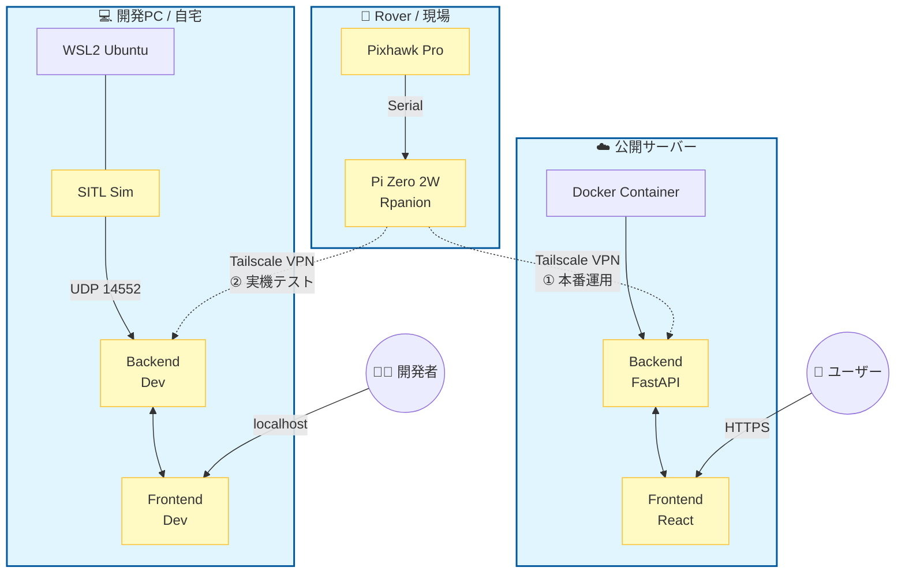

# システム構成図

本プロジェクトのハードウェアおよびネットワーク構成図です。

```mermaid
graph TD
    %% クラス定義（色分け）
    classDef hardware fill:#e1f5fe,stroke:#01579b,stroke-width:2px;
    classDef software fill:#fff9c4,stroke:#fbc02d,stroke-width:1px;
    classDef network fill:#f3e5f5,stroke:#7b1fa2,stroke-width:2px,stroke-dasharray: 5 5;

    %% 1. 現場 (Rover)
    subgraph Rover_System [🚜 Rover / 現場]
        direction TB
        Pixhawk[Pixhawk Pro]
        PiZero[Pi Zero 2W<br>Rpanion]
        
        Pixhawk -->|Serial| PiZero
    end

    %% 2. クラウド (Server)
    subgraph Cloud_Server [☁️ 公開サーバー]
        direction TB
        Docker[Docker Container]
        Backend_Prod[Backend<br>FastAPI]
        Frontend_Prod[Frontend<br>React]
        
        Docker --> Backend_Prod
        Backend_Prod <--> Frontend_Prod
    end

    %% 3. 自宅 (Dev PC)
    subgraph Home_PC [💻 開発PC / 自宅]
        direction TB
        WSL[WSL2 Ubuntu]
        SITL[SITL Sim]
        Backend_Dev[Backend<br>Dev]
        Frontend_Dev[Frontend<br>Dev]
        
        WSL --- SITL
        SITL -->|UDP 14552| Backend_Dev
        Backend_Dev <--> Frontend_Dev
    end

    %% 通信 (Tailscale VPN)
    PiZero -.->|Tailscale VPN<br>① 本番運用| Backend_Prod
    PiZero -.->|Tailscale VPN<br>② 実機テスト| Backend_Dev

    %% ユーザーアクセス
    User((👤 ユーザー)) -->|HTTPS| Frontend_Prod
    Dev((👨‍💻 開発者)) -->|localhost| Frontend_Dev

    %% スタイル適用
    class Rover_System,Cloud_Server,Home_PC hardware;
    class Pixhawk,PiZero,Backend_Prod,Frontend_Prod,SITL,Backend_Dev,Frontend_Dev software;
```
