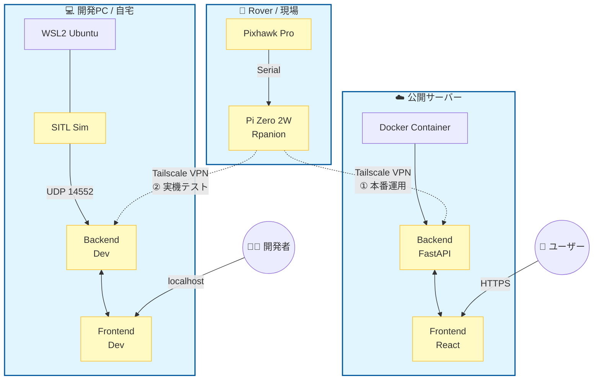
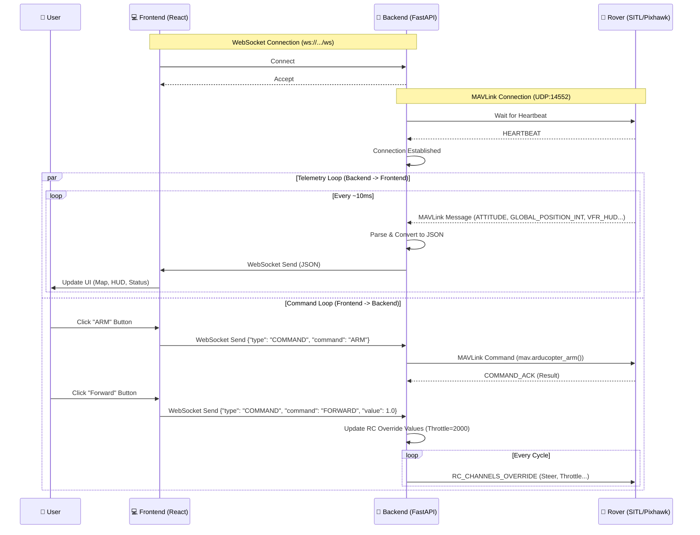
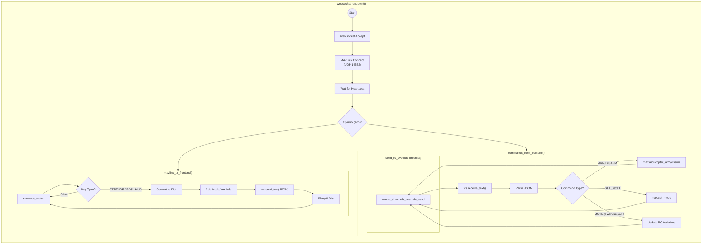

# システム構成図

本プロジェクトのハードウェアおよびネットワーク構成図です。



## 目次

- [システム構成図](#システム構成図)
  - [目次](#目次)
  - [データフロー詳細 (Frontend ⇔ Backend ⇔ Rover)](#データフロー詳細-frontend--backend--rover)
    - [通信シーケンス](#通信シーケンス)
    - [内部処理フロー (backend/main.py)](#内部処理フロー-backendmainpy)
    - [メッセージ定義](#メッセージ定義)
      - [1. Backend -\> Frontend (Telemetry)](#1-backend---frontend-telemetry)
      - [2. Frontend -\> Backend (Command)](#2-frontend---backend-command)

## データフロー詳細 (Frontend ⇔ Backend ⇔ Rover)

フロントエンドとバックエンド、そして Rover (SITL/実機) 間のデータ処理フロー詳細です。

### 通信シーケンス



### 内部処理フロー (backend/main.py)

`backend/main.py` 内部では、主に2つの非同期タスクが並行して動作しています。



### メッセージ定義

#### 1. Backend -> Frontend (Telemetry)

バックエンドからフロントエンドへは、以下の形式の JSON が送信されます。

```json
{
  "type": "GLOBAL_POSITION_INT",
  "data": {
    "time_boot_ms": 12345678,
    "lat": 353632610,
    "lon": 138730000,
    "alt": 10000,
    "relative_alt": 5000,
    "vx": 0,
    "vy": 0,
    "vz": 0,
    "hdg": 18000
  }
}
```

#### 2. Frontend -> Backend (Command)

フロントエンドからバックエンドへは、以下の形式の JSON を送信して操作を行います。

```json
// モード変更
{
  "type": "COMMAND",
  "command": "SET_MODE",
  "value": "GUIDED",
  "timestamp": 1700000000000
}

// マニュアル操作
{
  "type": "COMMAND",
  "command": "FORWARD",
  "value": 1.0,
  "timestamp": 1700000000000
}
```
