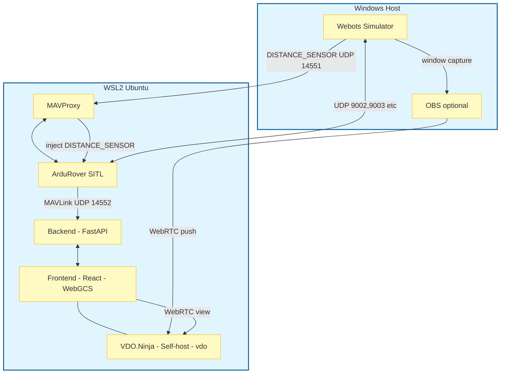

# Webots シミュレーション構成 (Architecture)

本ドキュメントは、本プロジェクトで **Webots + ArduRover SITL** を使って実機なしで検証する際の、システム構成とデータフローをまとめたものです。

- Webots: 3D環境/物理演算/センサー模擬
- ArduRover SITL: 仮想機体 (ArduPilot Rover)
- MAVProxy: ブリッジ（GCS転送、距離センサー注入など）
- rover-gcs: Web UI (React) + Middleware (FastAPI)

詳細手順は [docs/webots_setup.md](./webots_setup.md) を参照してください。

---

## システム構成図

---

## データフロー（概要）

### 1) 操縦・テレメトリ（MAVLink）

- SITL は MAVLink テレメトリを UDP:14552 に出力
- Backend (FastAPI) は UDP:14552 を待ち受け、WebSocket(`/ws`) でフロントエンドへ配信
- フロントエンドは操作入力を WebSocket で Backend に送り、Backend が SITL へ RC override / mode change を送る

この経路は [docs/architecture.md](./architecture.md) の「Frontend ⇔ Backend ⇔ Rover」と同じです（Rover が SITL に置き換わるだけ）。

### 2) Webots ↔ SITL（物理/センサー同期）

- Webots と SITL は、Webots用の ArduPilot 連携モデル（例: `--model webots-python`）を通じて UDP で同期します。
- 代表的に UDP:9002/9003 等が利用されます（環境・起動オプションに依存）。

---

## 距離センサー（LiDAR/Sonar）の注入

Webots 側の距離センサーを、ArduPilot 側の RangeFinder として成立させるため、`DISTANCE_SENSOR` を **SITL(master)** に注入します。

- Webots → `udpout:<WSL_IP>:14551` に `DISTANCE_SENSOR` を送信
- MAVProxy は `udpin:0.0.0.0:14551` を受信
- MAVProxy モジュール `webotsrf` が `DISTANCE_SENSOR` を SITL(master) へ再送して注入

関連:
- 起動スクリプト: [start_sitl4webots.sh](../start_sitl4webots.sh)
- MAVProxy モジュール: [mavproxy_modules/webotsrf.py](../mavproxy_modules/webotsrf.py)

---

## 映像（任意）

Webots は直接 WebRTC を配信しないため、必要に応じて次のような構成を取れます。

- Webots のカメラ表示ウィンドウを OBS でキャプチャ
- OBS から VDO.Ninja（self-host の `/vdo/`）へ WebRTC **push**
- WebGCS（Advanced Mode）で `/vdo/index.html?view=<ViewID>` を iframe 表示し、必要ならブラウザ内で物体検出（YOLO）を実行

詳細は [docs/webots_webrtc.md](./webots_webrtc.md) を参照してください。
