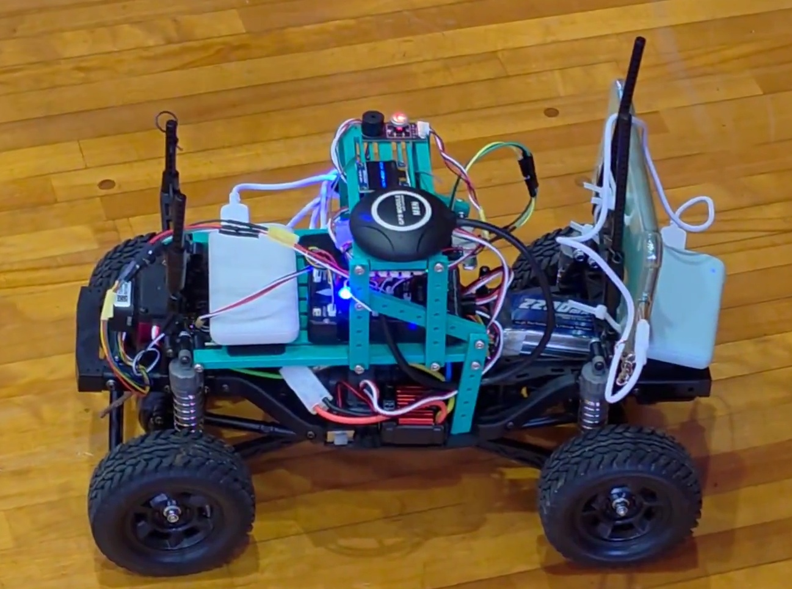

# ハードウェア構成

## 概要

本プロジェクトのローバーは、悪路走破性の高い「タミヤ CC-02」シャーシをベースに構築されています。
制御システムには **Pixhawk 2.4.8 PRO (ArduPilot)** を採用し、上位制御用コンパニオンコンピュータとして **Raspberry Pi Zero 2 WH** を搭載しています。

また、**スマートフォン (Xiaomi Mi 11 Lite 5G)** を搭載することで、LTE回線を利用した広域テレメトリー通信環境を実現しています。
電源系統は走行用（3S LiPo）と制御用（モバイルバッテリー 5V）を物理的に分離することで、高い安定性と信頼性を確保しました。

	

*図: 実際に使用しているローバーの写真 (`docs/images/rover_20251220.jpg`)。*

## 3Dプリント部品について

フライトコントローラー（Pixhawk）やRaspberry Pi、GPSモジュール等をシャーシに固定するためのマウントパーツは、3Dプリンタを使用して作成しました。
これらのマウントパーツの3Dモデルデータ（STLファイル）は、以下のサイトで公開されているものを使用しています。

* **引用元:** [ArduPilotローバーの製作① ArduPilotローバーの構成概要と組み立て - DAYSCAPE](https://dayscape.jp/blogs/all-blogs/ardupilot-rover-make-1-ardupilot-rover-assembly-overview#Section5)

## 構成パーツリスト

以下は、本ローバーの製作に使用したパーツの一覧です。

### 1. 通信・テレメトリー端末

| 品名 / 規格 | 役割 | 備考 |
| --- | --- | --- |
| **Xiaomi Mi 11 Lite 5G** | テレメトリー通信 / 上位ネットワーク接続 | LTE回線を使用し、PC（Mission Planner）と機体を距離無制限で接続。 手持ちの端末を流用したため、今回の製作費には含まず。 |

### 2. ローバー本体・制御系

| No. | カテゴリ | 品名 / 規格 | 価格 (税込) | 備考 | 購入先 |
| --- | --- | --- | --- | --- | --- |
| 1 | フライトコントローラ | Pixhawk 2.4.8Pro セット | ¥12,806 | GPS (NEO-M8N)、スイッチ、ブザー、OLED含む ※ログより fmuv3 と判明 | AliExpress |
| 2 | コンパニオンコンピュータ | Raspberry pi Zero 2 WH | ¥4,680 | はんだ付け済みヘッダー付き | Amazon |
| 3 | LiDARセンサー | Benewake TF-Luna | ¥3,920 | 障害物検知用 | Amazon |
| 4 | SDカード*2 | KIOXIA microSD 32GB UHS-I Class10 | ¥1,088 | 2枚  Raspberry Pi と Pixhawk用 | Amazon |
| 5 | モバイルバッテリー*2 | ヨドバシ パワーバンクC25 2500mAh | ¥1,000 | 2個 、重さ56g/個 Raspberry Piとスマホ用 | ヨドバシ.com |
| 6 | バッテリー | Zeee 3S 2200mAh 120C (2本セット) | ¥4,639 | | Amazon |
| 7 | 充電器 | ISDT 608PD | ¥3,399 | USB-C対応スマート充電器 | Amazon |
| 8 | 車体 (シャーシ) | タミヤ CC-02 | ¥20,691 | モーター、タイヤ含むと想定 | Amazon |
| 9 | ESC (アンプ) | ブラシモーター用ESC (QuicRun 1060等) | ¥3,920 | 設定「FR」で使用中 | Amazon |
| 10 | サーボ | DS3218 20kg | ¥1,788 | | Amazon |
| 11 | 送受信機 (プロポ) | T8FB BT | ¥6,970 | SBUS接続で使用 | Amazon |
| 12 | その他部材 | ケーブル、コネクタ、両面テープなど | ¥2,000 | 消耗品 | AliExpress/Amazon |

### 合計金額

| 項目 | 金額 |
| --- | --- |
| **合計** | **¥66,901** |
| (内訳) RC部分 | ¥41,407 |
| (内訳) Ardupilot化追加費用 | ¥22,494 |
| (内訳) その他部材 | ¥2,000 |
| ※スマートフォン端末代は除く | |